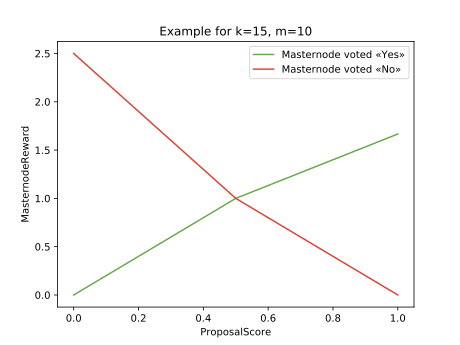
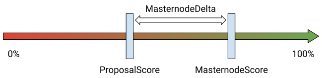

# Dash Governance System: proposals distribution and measuring their efficiency <!-- omit in toc -->

## Abstract <!-- omit in toc -->

Decentralized voting and self-funding allow cryptocurrencies to make joint decisions and finance their development. Dash cryptocurrency has a working self-funding and decision-making system—Dash Governance System. While it is fully operational, as currently designed, it does not incentivize voting efficiency. Dash Governance System struggles to scale with the number of proposals rising as each participant needs to review each proposal. In this work, a new mechanism to distribute proposals among the participants is proposed. It motivates participants to vote responsibly as the success of all accepted proposals is estimated after the completion.

## Authors <!-- omit in toc -->

<!--
\text{hib} \langle\text{at}\rangle \text{pm} \langle\text{dot}\rangle \text{me}
-->

<!--
\text{andreyiv} \langle\text{at}\rangle \text{pm} \langle\text{dot}\rangle \text{me}
-->

<!--
\text{yyanovich} \langle\text{at}\rangle \text{hse} \langle\text{dot}\rangle \text{ru}
-->

## Table of contents <!-- omit in toc -->

- [Motivation](#motivation)
- [Dash cryptocurrency](#dash-cryptocurrency)
  - [Masternode network](#masternode-network)
  - [Proposals](#proposals)
  - [Superblocks](#superblocks)
  - [Masternodes reward](#masternodes-reward)
- [Voting efficiency](#voting-efficiency)
  - [Proposal distribution](#proposal-distribution)
  - [Voting efficiency evaluation](#voting-efficiency-evaluation)
    - [The first voting](#the-first-voting)
    - [The second voting](#the-second-voting)
    - [Masternode reward](#masternode-reward)
      - [ProposalScore](#proposalscore)
      - [MasternodeReward](#masternodereward)
      - [MasternodePenalty](#masternodepenalty)
      - [MasternodePayout](#masternodepayout)
    - [Better off playing by the rules](#better-off-playing-by-the-rules)
- [Notes](#notes)
  - [Most votes are «Yes»](#most-votes-are-%c2%abyes%c2%bb)
  - [Second voting start](#second-voting-start)
  - [Private voting](#private-voting)
- [Conclusion](#conclusion)

## Motivation

Cryptocurrencies being open-source software often do not have a sustainable source of funding and similar to non-profit organizations they rely on donations. This can lead to conflicts of interest, weakening the neutrality of the decisions taken, for instance, if development is funded partially or under certain conditions[[1]](https://opensource.org/conflict_of_interest_policy "Conflict of Interest Policy | Open Source Initiative").

Dash cryptocurrency [[2]](Assets/Darkcoin_Peer-to-Peer_Crypto-Currency_with_Anonymous_Blockchain_Transactions_and_an_Improved_Proof-of-Work_System.pdf "Darkcoin: Peer-to-Peer Crypto-Currency with Anonymous Blockchain Transactions and an Improved Proof-of-Work System") [[3]](Assets/Dash_A_Payments-Focused_Cryptocurrency.pdf "Dash: A Payments-Focused Cryptocurrency") is based on Bitcoin source code [[4]](Assets/Bitcoin_A_Peer-to-Peer_Electronic_Cash_System.pdf "Bitcoin: A Peer-to-Peer Electronic Cash System") and it is one of the first cryptocurrencies to fund its development directly from its blockchain. Dash has a self-funding and decision-making system—Dash Governance System (DGS) [[5]](Assets/Dash_Governance_System_Analysis_and_Suggestions_for_Improvement.pdf "Dash Governance System: Analysis and Suggestions for Improvement"). The problem of its current implementation is that it does not encourage to vote wisely and judiciously which in turn can lead to non-optimal decisions.

In this work, we will consider a modification of the DGS which incentivizes participants to vote more efficiently and lessens the burden on the participants.

## Dash cryptocurrency

Unlike Bitcoin, Dash miners do not get all mined coins. The Dash network also rewards those who make important decisions and those who are doing a rewarded work—not only miners but also developers and other professionals [[6]](https://docs.dash.org/en/stable/governance/understanding.html "Understanding Dash Governance — Dash latest documentation"). The annual budget for self-funding exceeded $30 million in May 2018 [[7]](https://web.archive.org/web/20190613080244/https://docs.dash.org/en/stable/introduction/features.html "Features — Dash latest documentation").

### Masternode network

Users can run so-called masternodes by making a 1000 DASH returnable deposit. Masternode network enables instant transactions (InstantSend) as well as anonymous transactions (PrivateSend), which distinguishes Dash from Bitcoin. In January 2018 the cost of one masternode reached over $1 million [[8]](https://coinmarketcap.com/currencies/dash/ "Dash (DASH) price, charts, market cap, and other metrics | CoinMarketCap"). Despite the fact that the number of masternodes varies, it does not generally change substantially over a small period of time. In this work for the sake of simplicity, we will treat the number of masternodes as a constant. The total number of masternodes can be bounded above as Dash emission is finite.

<!--
|Masternodes| \leq \frac{TotalEmission}{1000} = 18900
-->

Due to the high masternode worth and their limited number, the smooth work of the Dash network is in the direct interest of the masternode owners. Masternodes participate in the development of the network by voting—this is how decisions are made and funding is allocated. Masternode owners, as well as miners, receive 45% of newly created coins. The rest 10% is the self-funding budget.

|                      | Emission |
| :------------------- | -------: |
| Proof-of-Work Mining |      45% |
| Masternode Network   |      45% |
| Governance Budget    |      10% |

### Proposals

The governance budget is used to fund various projects that are beneficial to the Dash network. Any person can create a proposal to obtain funding or to make a decision on behalf of the network. A proposal has the following fields:

1. Name
2. URL-address of the description
3. Financing start date
4. Financing end date
5. Payment address
6. Payment amount

Each proposal submission costs 5 DASH to prevent spam. The masternode network votes «Yes» or «No» after the proposal is submitted. The vote can be canceled before the voting is concluded (or more precisely changed to «Abstain»). The proposal is considered to have passed if the number of «Yes» votes minus the number of «No» votes is more than 10% of the total number of masternodes.

<!--
\text{Proposal passed} \iff YesVotes - NoVotes > 10\% * |Masternodes|
-->

### Superblocks

The results of the voting are summarized approximately once a month (more precisely—every 16616 blocks) when so-called superblock is created. The superblock is a blockchain block that distributes both mining reward and self-funding budget.

<!--
\underbrace{\text{Block} \gets \text{Block} \gets ... \gets \text{Superblock}}_{\text{16616 blocks } \approx \text{ 1 month}} \gets ... \gets \underbrace{\text{Block} \gets \text{Block} \gets ... \gets \text{Superblock}}_{\text{16616 blocks } \approx \text{ 1 month}}
-->

### Masternodes reward

Since masternodes receive a fixed percentage of newly created coins, the overall reward for any masternode over a given period of time can be calculated as follows

<!--
MasternodeReward = \frac{45\% * Emission}{|Masternodes|}
-->
,

where `Emission` is the amount of newly created coins over the given period of time.

## Voting efficiency

- Masternodes share the reward equally among themselves. The reward of any given masternode does not depend on its voting efficiency. Because of masternode owners are not directly incentivized to invest their time in researching the proposal. Masternodes that vote randomly or those that do not vote at all receive the same reward as masternodes that invest time and resources to vote wisely. A direct incentive is required to achieve efficiency in voting.

- With the development of the network and Dash price appreciation, the number of proposals can rise significantly. This further decreases the voting efficiency as proposal research can be very time-consuming. Despite the fact that the DGS is protected against spam, the number of proposals can be too high for each masternode to thoroughly review each proposal [[9]](https://dashvotetracker.com/past.php "Dash Budget Proposal Vote Tracker").

### Proposal distribution

It is more efficient to assign each proposal to a group of masternodes that can participate in the voting and that will track the implementation progress. Those masternodes will be better informed about the situation as if the proposal passes their reward will depend on the efficiency of the proposal implementation.

Function `voters(p)` defines a random subset of masternodes that can vote on proposal `p`.

<!--
voters : Proposals \to 2^{Masternodes}
-->

<!--
0 < |voters(p)| \leq |Masternodes|
-->

Similar to traditional companies, where a large number of decisions are made, more important decisions are made more responsibly. Strategically important proposals such as altering development trajectory or making amendments to the protocol typically do not request funding[[10]](https://www.dashcentral.org/p/2mb-blocksize "Proposal \"2mb-blocksize\" - DashCentral.org"). To make such decisions all masternodes will take part in voting.

<!--
voters(p) = Masternodes \iff p.fundingAmount = 0
-->

For other proposals let the number of chosen masternodes be proportional to the requested funding.

<!--
|voters(p)| \sim p.fundingAmount
-->

As proposals often include a submission fee of 5 DASH in the requested amount let us not take them into account.

<!--
p.fundingAmount = \max(p.requestedAmount - 5, 0)
-->

Some people can own a significant number of masternodes [[11]](https://chainz.cryptoid.info/dash/#!rich "Richest Addresses — Dash Explorer"). The proportional dependency also complicates the attack when an owner of a significant number of masternodes votes in favor of themself. If the owner creates a proposal with a small funding amount then the probability of their masternodes to be in a voting subset is low. And if the funding amount is substantial then the voting power of the masternodes under control will be insufficient to push the proposal through.

### Voting efficiency evaluation

To determine the fair reward it is required to evaluate the efficiency of the voting by measuring the proposal implementation results directly. In particular, this means that if the proposal did not pass it is impossible to evaluate the efficiency of the voting.

It is also necessary to introduce a voting fee because if a masternode owner does not have any financial implications when voting irresponsibly, even additional reward may not be sufficient enough motivation to thoroughly review and research the proposal.

Lastly, the proposed changes should not alter the supply. If in some cases coins disappear from the circulating supply the level of masternode owners involvement in DGS can fall. On the other hand, the emission increase is not generally welcomed by the community.

#### The first voting

Let us introduce a fixed voting fee of 1 DASH that is paid by each masternode for each proposal. Also, let us keep the criterion of the approval of the proposal `p` adjusted for the chosen masternodes `voters(p)`.

<!--
p \text{ passed} \iff YesVotes - NoVotes > 10\% * |voters(p)|
-->

In case the proposal did not pass, the masternodes that voted get 1 DASH back. The ability to cancel the vote should also be preserved. This would avoid an incentive to change «Yes» vote to «No» if a masternode owner would like to get 1 DASH back.

#### The second voting

Among those masternodes that participated in the first voting, second voting is taken to assess the results of the proposal. In this free and private voting, the masternodes assess the proposal results. Each masternode grades the proposal in percentage: 100%—is the best possible proposal implementation result, 0%—is the worst possible proposal implementation result. And 50%—is a threshold that separates satisfactory results from unsatisfactory ones. If a masternode does not vote in the second voting it does not get any reward and thus loses 1 DASH.

#### Masternode reward

Let us assume that in the first voting `n` masternodes voted in total: `k` of them voted «Yes» and `m > 0` voted «No». In such a way the total fees collected amounts to `k DASH + m DASH = n DASH`. Let us assume that the proposal passed and all `n` masternodes also participated in the second voting. To determine the fair reward it is required to distribute `n DASH` back among `k + m = n` masternodes based on the initial masternode votes («Yes» or «No») and the results of the second voting. Also, an incentive to vote impartially is required so that the vote in the second voting is not motivated by the vote in the first voting.

##### ProposalScore

To define the result of the proposal implementation let `ProposalScore` be the arithmetic mean of all the masternode votes in the second voting.

<!--
ProposalScore = \frac{MasternodeScore_1 + ... + MasternodeScore_{n}}{n}
-->

##### MasternodeReward

By having the result of the proposal implementation (`ProposalScore`) and the initial votes («Yes» or «No») we can evaluate the efficiency of the first voting. It is worth noting that we want to evaluate the initial vote because during the first voting the most challenging work is done.

In case of the best possible result of the proposal implementation let masternodes that voted «Yes» equally share all the fees collected for the proposal.

<!--
ProposalScore = 100\% \iff MasternodeReward =
\begin{cases}
  \frac{n}{k} & \text{voted yes} \\
  0 & \text{voted no}
\end{cases}
-->

In case the proposal got 50% score let all masternodes that voted get the voting fee back.

<!--
ProposalScore = 50\% \iff MasternodeReward = 1
-->

In case of the worst possible result of the proposal implementation let masternodes that voted «No» equally share all the fees collected for the proposal.

<!--
ProposalScore = 0\% \iff MasternodeReward =
\begin{cases}
  0 & \text{voted yes} \\
  \frac{n}{m} & \text{voted no}
\end{cases}
-->

Let us plot those points on `ProposalScore`, `MasternodeReward` plane. The intermediate values are from linear interpolation using the values for given main cases.

Accordingly, the higher the `ProposalScore`, the higher the reward for those masternodes that initially voted «Yes». Similarly, the less `ProposalScore`, the higher reward for those masternodes that initially voted «No». More formally, `MasternodeReward` can be calculated using one of the following formulas:

<!--
MasternodeReward =
\begin{cases}
  2 * ProposalScore & ProposalScore \leq 50\% \text{ \& voted Yes} \\
  (2 * ProposalScore - 1) * \frac{m}{k} + 1 & ProposalScore > 50\% \text{ \& voted Yes} \\
  (1 - 2 * ProposalScore) * \frac{k}{m} + 1 & ProposalScore \leq 50\% \text{ \& voted No} \\
  2 - 2 * ProposalScore & ProposalScore > 50\% \text{ \& voted No} \end{cases}
-->

Let us prove that such distribution does not change the emission when `ProposalScore ≤ 50%`.

<!--
\underbrace{k - k * \big[2 * ProposalScore\big]}_{\text{Voted Yes}} + \underbrace{m - m * \big[(1 - 2 * ProposalScore) * \frac{k}{m} + 1\big]}_{\text{Voted No}} =
-->

<!--
= k * (1 - 2 * ProposalScore) + m * \big(1 - (1 - 2 * ProposalScore) * \frac{k}{m} - 1 \big) =
-->

<!--
= k * (1 - 2 * ProposalScore) - (1 - 2 * ProposalScore) * k = 0
-->

Likewise, when `ProposalScore > 50%`.

<!--
\underbrace{k - k * \big[(2 * ProposalScore - 1) * \frac{m}{k} + 1\big]}_{\text{Voted Yes}} + \underbrace{m - m * \big[2 - 2 * ProposalScore\big]}_{\text{Voted No}} =
-->

<!--
= k * \big(1 - (2 * ProposalScore - 1) * \frac{m}{k} - 1\big) + m * (2 * ProposalScore - 1) =
-->

<!--
= -(2 * ProposalScore - 1) * m + m * (2 * ProposalScore - 1) = 0
-->

##### MasternodePenalty

In order to incentivize masternodes to evaluate the proposal implementation in the second voting objectively let us introduce a personal penalty for each masternode. The masternode penalty is a difference in score between the masternode and the network. Moreover, result overvaluation with the initial «Yes» vote as well as result undervaluation with the initial «No» vote lead to twice the penalty.

<!--
MasternodeDelta = MasternodeScore - ProposalScore
-->

<!--
MasternodePenalty =
\begin{cases}
  |MasternodeDelta| & MasternodeDelta > 0 \text{ \& voted Yes} \\
  |MasternodeDelta| & MasternodeDelta < 0 \text{ \& voted No} \\
  |MasternodeDelta|/2 & \text{otherwise}
\end{cases}
-->

##### MasternodePayout

As a result, masternode payout for participation in the votings is the reward minus the penalty. If the penalty is greater than the reward the masternode gets nothing.

<!--
MasternodePayout = \max(MasternodeReward - MasternodePenalty, 0)
-->

Additionally, half the masternodes that have the lowest penalties equally share all coins collected as penalties. This helps to avoid change in emission and incentivizes masternode owners to vote wisely in the second voting even if their initial votes did not meet the expectations.

#### Better off playing by the rules

Assuming a masternode owner can objectively evaluate the proposal implementation, they will be better off by submitting that evaluation as a vote in the second voting.

- If the initial vote met the expectations, they will get a `MasternodeReward`. Submitting an objective evaluation of the proposal implementation and thus minimizing `MasternodePenalty` is in their best interest. Moreover if they are in half of the masternodes with the lowest penalties their penalty would be offset by even greater reward.
- If the initial vote did not meet the expectations, the masternode owner could try to shift the `ProposalScore` to their advantage by providing subjective `MasternodeScore`. However in that case they are risking not getting any `MasternodeReward` because of the high `MasternodePenalty`. A much more beneficial strategy would be to minimize the penalty to get into the half of the masternodes with the lowest penalties and get a significant reward in addition to `MasternodeReward`.

## Notes

### Most votes are «Yes»

The second voting is only possible if a proposal `p` passed, which in turn means that the number of «Yes» votes is always greater that the number of «No» votes.

<!--
p \text{ passed} \implies YesVotes - NoVotes > 10\% * |voters(p)| \implies
-->

<!--
\implies YesVotes - NoVotes > 0 \implies YesVotes > NoVotes
-->

Therefore, the potential reward for those masternodes that vote «No» is always higher. This may seem like it is better to simply vote «No» all the time. Actually this is not the case as «Yes»/«No» ratio maintains the market balance — the more there are «Yes» votes the higher the potential reward for voting «No» and vice versa. In other words, the higher reward is offset by higher risks.

Despite the situations in which there is not a single «No» vote being highly unlikely, it is still possible. In such a case let `MasternodeReward` be `1`. Despite the absence of «No» votes the second voting still should be conducted to evaluate the proposal implementation.

### Second voting start

As the second voting measures the efficiency of the proposal implementation, even the author of the proposal may struggle to provide the right date to start the second voting. Instead of fixing the start date we can start the second voting immediately after the proposal passed. After 10% of the masternodes voted we can set the deadline for the voting — the next superblock after the current superblock is mined. It is also necessary to have the ability to cancel the vote to avoid premature voting.

### Private voting

Private voting can be implemented in a public Blockchain by hashing the vote with a secret string.

<!--
HashedVote = X11(SecretString + "-" + MasternodeScore)
-->
,

where `X11()` — is a hash function used by the Proof-of-Work consensus algorithm in Dash.

During the voting hashed vote is recorded on Dash Blockchain. In case the masternode owner wants to change their vote a new similar transaction is created. When voting concludes each masternode reveals its vote by publishing the secret string for the latest transaction. This task can be delegated to masternode itself as masternode is online day and night and can publish the secret string immediately after the voting is concluded. Such a decision allows the deadline for the vote revealing to be as tight as a few hours. If the secret string had not been revealed in time the masternode did not participate in the second voting.

## Conclusion

Proposed Dash Governance System modification allows to distribute the proposals and assess the results of their implementations. By distributing the proposals among random subsets of masternodes not only we lessen the burden on masternodes owners but also complicate the attack when an owner of a significant number of masternodes votes in favor of themself. by introducing a voting fee the decisions are made more responsibly and those who voted efficiently are rewarded without a need to alter the emission. Free second voting enables the network to assess the proposal results. By having privacy and personal penalties masternodes are better off when voting objectively.
