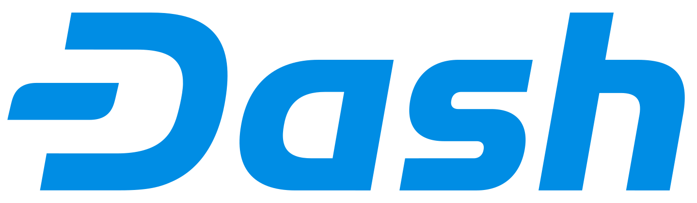
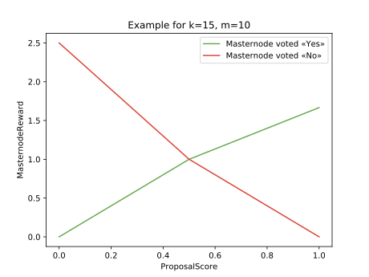
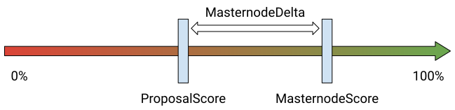

# Распределение предложений и оценка эффективности принятых решений в Dash Governance System <!-- omit in toc -->

## Аннотация <!-- omit in toc -->

Децентрализованное голосование и самофинансирование позволяют криптовалютам принимать совместные решения и финансировать свое развитие. Криптовалюта Dash имеет работающую систему самофинансирования и принятия решений Dash Governance System, но в текущем виде она не поощряет эффективное голосование. Dash Governance System плохо масштабируется с увеличением количества предложений, так как каждому участнику нужно рассматривать каждое предложение. В этой работе предлагается механизм распределения предложений между участниками. В дальнейшем участники голосования проводят оценку реализации предложений, что позволяет вознаграждать тех, кто проголосовал эффективно и непредвзято.

## Авторы <!-- omit in toc -->

<!--
\text{hib} \langle\text{at}\rangle \text{pm} \langle\text{dot}\rangle \text{me}
-->

<!--
\text{andreyiv} \langle\text{at}\rangle \text{pm} \langle\text{dot}\rangle \text{me}
-->

<!--
\text{yyanovich} \langle\text{at}\rangle \text{hse} \langle\text{dot}\rangle \text{ru}
-->

## Содержание <!-- omit in toc -->

- [Введение](#Введение)
- [Криптовалюта Dash](#Криптовалюта-dash)
  - [Masternode Network](#masternode-network)
  - [Proposals](#proposals)
  - [Superblocks](#superblocks)
  - [Вознаграждение мастернод](#Вознаграждение-мастернод)
- [Эффективность голосования](#Эффективность-голосования)
  - [Распределение предложений](#Распределение-предложений)
  - [Оценка эффективности голосования](#Оценка-эффективности-голосования)
    - [Первое голосование](#Первое-голосование)
    - [Второе голосование](#Второе-голосование)
    - [Вознаграждение мастерноды](#Вознаграждение-мастерноды)
      - [Proposal Score](#proposal-score)
      - [Masternode Reward](#masternode-reward)
      - [Masternode Penalty](#masternode-penalty)
      - [Masternode Payout](#masternode-payout)
    - [Выгодно играть по правилам](#Выгодно-играть-по-правилам)
- [Примечания](#Примечания)
  - [Голосов «Yes» всегда больше](#Голосов-yes-всегда-больше)
  - [Старт второго голосования](#Старт-второго-голосования)
  - [Закрытое голосование](#Закрытое-голосование)
- [Заключение](#Заключение)

## Введение

Криптовалюты, являющиеся свободным программным обеспечением с открытым исходным кодом, зачастую не имеют постоянных источников финансирования, и подобно некоммерческим организациям полагаются на пожертвования. Это может приводить к конфликтам интересов, снижая беспристрастность принятия решений, например, если разработка финансируется выборочно или на определенных условиях[[1]](https://opensource.org/conflict_of_interest_policy "Conflict of Interest Policy | Open Source Initiative").

Криптовалюта Dash[[2]](Assets/Darkcoin_Peer-to-Peer_Crypto-Currency_with_Anonymous_Blockchain_Transactions_and_an_Improved_Proof-of-Work_System.pdf "Darkcoin: Peer-to-Peer Crypto-Currency with Anonymous Blockchain Transactions and an Improved Proof-of-Work System")[[3]](Assets/Dash_A_Payments-Focused_Cryptocurrency.pdf "Dash: A Payments-Focused Cryptocurrency"), основанная на исходном коде Bitcoin[[4]](Assets/Bitcoin_A_Peer-to-Peer_Electronic_Cash_System.pdf "Bitcoin: A Peer-to-Peer Electronic Cash System"), это одна из первых криптовалют, которая оплачивает свое развитие напрямую из Blockchain. Dash имеет систему децентрализованного самофинансирования и принятия решений — Dash Governance System[[5]](Assets/Dash_Governance_System_Analysis_and_Suggestions_for_Improvement.pdf "Dash Governance System: Analysis and Suggestions for Improvement"). Проблема текущей реализации Dash Governance System в том, что она не поощряет вдумчивое и эффективное голосование, что в свою очередь может приводить к неоптимальному принятию решений.

В данной работе будет рассмотрена модификация Dash Governance System, которая создает мотивацию для более эффективного голосования и снижает нагрузку на ее участников.

## Криптовалюта Dash

В отличие от Bitcoin, где все создаваемые монеты распределяются между майнерами, сеть Dash вознаграждает тех, кто принимает важные для сети решения и тех, кто выполняет полезную работу — не только майнеров, но и, например, разработчиков или других специалистов[[6]](https://docs.dash.org/en/stable/governance/understanding.html "Understanding Dash Governance — Dash latest documentation"). В мае 2018 годовой бюджет самофинансирования Dash превышал $30 миллионов[[7]](https://web.archive.org/web/20190613080244/https://docs.dash.org/en/stable/introduction/features.html "Features — Dash latest documentation").

### Masternode Network

Пользователи могут запустить так называемую мастерноду, сформировав возвратный залог 1000 DASH. Сеть мастернод позволяет проводить мгновенные (InstantSend) и анонимные (PrivateSend) транзакции, что отличает Dash от Bitcoin. В январе 2018 года стоимость одной мастерноды превышала $1 миллион[[8]](https://coinmarketcap.com/currencies/dash/ "Dash (DASH) price, charts, market cap, and other metrics | CoinMarketCap"). Несмотря на то, что число мастернод не постоянно, как правило, в течении короткого отрезка времени оно меняется незначительно. В данной работе для простоты будем считать, что количество мастернод постоянно. Поскольку эмиссия DASH ограничена, то суммарное количество мастернод можно оценить сверху.

<!--
|Masternodes| \leq \frac{TotalEmission}{1000} = 18900
-->

Из-за высокой стоимости мастернод и их ограниченного количества, слаженная работа сети в прямых интересах владельцев мастернод. Мастерноды принимают участие в развитии сети путем голосования — так принимаются важные решения и выделяется финансирование для развития сети. Владельцы мастернод, ровно, как и майнеры, получают по 45% создаваемых монет. Оставшиеся 10% — это бюджет самофинансирования.

|                      | Эмиссия |
| :------------------- | ------: |
| Proof-of-Work Mining |     45% |
| Masternode Network   |     45% |
| Governance Budget    |     10% |

### Proposals

Бюджет самофинансирования предназначен для оплаты различных проектов, которые полезны для сети Dash. Любой человек может создать предложение (Proposal) для получения финансирования или принятия решения от имени сети. Предложение содержит следующие поля:

1. Название
2. URL-адрес описания
3. Дата начала финансирования
4. Дата окончания финансирования
5. Адрес для финансирования
6. Сумма финансирования

В целях предотвращения спама, внесение каждого предложения стоит 5 DASH. После отправки предложения сеть мастернод голосует «Yes» или «No». До окончания голосования голос можно поменять или отменить (более точно — поменять на «воздержаться»). Предложение о финансировании или о принятии какого-либо решения считается одобренным сетью, если голосов «Yes» больше чем голосов «No» на 10% от общего числа мастернод.

<!--
\text{Proposal passed} \iff YesVotes - NoVotes > 10\% * |Masternodes|
-->

### Superblocks

Итоги голосования автоматически подводятся примерно раз в месяц (более точно — раз в 16616 блоков) во время формирования так называемого суперблока. Суперблок — это блок из Blockchain, который помимо вознаграждения для майнеров распределяет бюджет самофинансирования.

<!--
\underbrace{\text{Block} \gets \text{Block} \gets ... \gets \text{Superblock}}_{\text{16616 blocks } \approx \text{ 1 month}} \gets ... \gets \underbrace{\text{Block} \gets \text{Block} \gets ... \gets \text{Superblock}}_{\text{16616 blocks } \approx \text{ 1 month}}
-->

### Вознаграждение мастернод

Поскольку вознаграждение мастернод — это фиксированный процент создаваемых монет, то суммарное вознаграждение любой мастерноды за данный период времени может быть вычислено по формуле

<!--
MasternodeReward = \frac{45\% * Emission}{|Masternodes|}
-->
,

где `Emission` — это созданные за данный период времени монеты DASH.

## Эффективность голосования

- Мастерноды делят соответствующее вознаграждение поровну между собой и вознаграждение какой-то конкретной мастерноды никак не зависит от эффективности голосования. Из-за этого владелец мастерноды не имеет прямой мотивации тратить время на детальное изучение предложения. Мастерноды, которые голосуют случайным образом или не голосуют вовсе, получают такое же вознаграждение, как и мастерноды, которые тратят ресурсы на изучение и голосуют сознательно. Для эффективного голосования требуется поощрение мастернод, которые голосуют эффективно.

- С развитием сети и ростом цены Dash, количество предложений для голосования может значительно увеличиваться. Это дополнительно снижает эффективность голосования, ведь доскональное изучение каждого предложения очень затратно по времени. Несмотря на то, что Dash Governance System защищена от спама, количество реальных предложений может быть слишком велико для должного рассмотрения каждого предложения со стороны всех владельцев мастернод[[9]](https://dashvotetracker.com/past.php "Dash Budget Proposal Vote Tracker").

### Распределение предложений

Эффективнее определять для каждого предложения группу мастернод, которые смогут участвовать в голосовании и в дальнейшем будут пристально следить за реализацией предложения. Эти мастерноды будут лучше других осведомлены о ситуации, так как в случае одобрения предложения от эффективности его реализации будет зависеть их вознаграждение.

Функция `voters(p)` определяет случайное подмножество мастернод, которые могут участвовать в голосовании предложения `p`.

<!--
voters : Proposals \to 2^{Masternodes}
-->

<!--
0 < |voters(p)| \leq |Masternodes|
-->

Подобно традиционным компаниям, где принимается большое количество решений, важные решения будут приниматься с большей ответственностью. Стратегически важные решения, такие как выбор траектории развития или внесение каких-то изменений в протокол как правило не запрашивают финансирования[[10]](https://www.dashcentral.org/p/2mb-blocksize "Proposal \"2mb-blocksize\" - DashCentral.org"). Для принятия таких решений будут задействованы все местерноды.

<!--
voters(p) = Masternodes \iff p.fundingAmount = 0
-->

Для остальных предложений потребуем, чтобы количество выбираемых мастернод прямо пропорционально зависело от запрашиваемой суммы финансирования.

<!--
|voters(p)| \sim p.fundingAmount
-->

Поскольку предложения включают в запрашиваемую сумму возмещение 5 DASH, которые были потрачены на внесение предложения, не будем их учитывать.

<!--
p.fundingAmount = \max(p.requestedAmount - 5, 0)
-->

Некоторые люди могут владеть значительным количеством мастернод[[11]](https://chainz.cryptoid.info/dash/#!rich "Richest Addresses — Dash Explorer"). Пропорциональная зависимость числа выбираемых мастернод также усложняет атаку, при которой владелец большого числа мастернод голосует за предложение, созданное им самим. Если владелец создаст предложение с небольшой суммой финансирования, то вероятность того, что подконтрольные ему мастерноды попадут в группу голосующих мастернод невелика. А если предложение будет запрашивать значительное финансирование, то голоса подконтрольных ему мастернод будут незначительными. Это требование также распределяет и снижает нагрузку на владельцев мастернод при голосовании, позволяя сконцентрироваться на небольшом количестве предложений.

### Оценка эффективности голосования

Для определения справедливого вознаграждения необходимо оценивать эффективность голосования непосредственно по результатам реализации предложения. В частности это означает что если предложение не получило финансирования, то оценка эффективности голосования невозможна.

Также необходимо ввести плату за голосование, ведь если владелец мастерноды не влечет никаких финансовых потерь при безответственном голосовании, даже дополнительное вознаграждение может не стать достаточной мотивацией для досконального изучения предложения.

И наконец, вследствии предлагаемых изменений эмиссия не должна меняться. Если в каких-то случаях монеты будут пропадать из обращения, это может негативно сказаться на уровне вовлеченности владельцев мастернод в Dash Governance System. Увеличение же эмиссии, как правило, негативно встречается сообществом.

#### Первое голосование

Введем фиксированный платеж 1 DASH за голосование мастерноды в каждом предложении. Сохраним при этом критерий одобрения предложения `p` с поправкой на группу выбранных для голосования мастернод `voters(p)`.

<!--
p \text{ passed} \iff YesVotes - NoVotes > 10\% * |voters(p)|
-->

В случае, если предложение не получило одобрения, проголосовавшие мастерноды получают 1 DASH обратно. Также необходимо сохранить возможность отмены голоса. Это позволит избежать мотивации изменения голоса с «Yes» на «No», в случае, если владелец мастерноды захочет вернуть обратно 1 DASH.

#### Второе голосование

Среди участвующих в первом голосовании мастернод для оценки результатов предложения проводится повторное голосование. В этом бесплатном и закрытом голосовании мастерноды оценивают результат предложения. Каждая мастернода ставит свою оценку в процентах: 100% — это наилучший возможный результат реализации предложения, а 0% — это наихудший возможный результат реализации предложения. При этом 50% — это граница, которая отделяет удовлетворительные предложения от неудовлетворительных. Если мастернода не голосует во втором голосовании, она не получает никакого вознаграждения и как следствие теряет 1 DASH.

#### Вознаграждение мастерноды

Пусть в первом голосовании всего проголосовало `n` мастернод, из них «Yes» проголосовало `k`, а «No» проголосовало `m > 0`. Таким образом суммарный залог данного предложения составляет `k DASH + m DASH = n DASH`. Предположим, что предложение было одобрено сетью и все `n` мастернод также приняли участие во втором голосовании. Для определения справедливого вознаграждения необходимо распределить `n DASH` обратно между `k + m = n` мастернодами в соответствии с изначальными голосами мастернод («Yes» или «No») и результатом второго голосования. Также, необходимо создать мотивацию голосовать непредвзято, чтобы голос во втором голосовании не был мотивирован голосом в первом голосовании.

##### Proposal Score

Для определения результата реализации предложения введем соответствующую оценку `ProposalScore` как среднее арифметическое всех голосов мастернод во втором голосовании.

<!--
ProposalScore = \frac{MasternodeScore_1 + ... + MasternodeScore_{n}}{n}
-->

##### Masternode Reward

Имея оценку результата реализации предложения (`ProposalScore`) и исходные голоса мастернод («Yes» или «No»), мы можем оценить эффективность первого голосования. Стоит отметить, что мы хотим оценить именно исходный голос мастерноды, поскольку во время первого голосования нужно проделать самую сложную работу по изучению предложения.

В случае наилучшего возможного результата реализации предложения, потребуем, чтобы мастерноды, проголосовавшие «Yes» получали поровну весь залог данного предложения.

<!--
ProposalScore = 100\% \iff MasternodeReward =
\begin{cases}
  \frac{n}{k} & \text{voted yes} \\
  0 & \text{voted no}
\end{cases}
-->

В случае, если предложение получило оценку 50%, потребуем, чтобы исходный платеж 1 DASH был возвращен всем проголосовавшим мастернодам.

<!--
ProposalScore = 50\% \iff MasternodeReward = 1
-->

В случае наихудшего возможного результата реализации предложения, потребуем чтобы мастерноды, проголосовавшие «No» получали поровну весь залог данного предложения.

<!--
ProposalScore = 0\% \iff MasternodeReward =
\begin{cases}
  0 & \text{voted yes} \\
  \frac{n}{m} & \text{voted no}
\end{cases}
-->

Расположим эти точки на плоскости с осями `ProposalScore` и `MasternodeReward`. Для получения промежуточных значений вознаграждения мастернод проголосовавших «Yes» или «No», соединим соответствующие точки прямыми.

Таким образом, чем больше `ProposalScore`, тем больше вознаграждение тех мастернод, которые изначально проголосовали «Yes». Аналогично, чем меньше `ProposalScore`, тем больше вознаграждение тех мастернод, которые изначально проголосовали «No». Более формально, размер вознаграждения мастерноды `MasternodeReward` вычисляется по одной из следующих формул:

<!--
MasternodeReward =
\begin{cases}
  2 * ProposalScore & ProposalScore \leq 50\% \text{ \& voted Yes} \\
  (2 * ProposalScore - 1) * \frac{m}{k} + 1 & ProposalScore > 50\% \text{ \& voted Yes} \\
  (1 - 2 * ProposalScore) * \frac{k}{m} + 1 & ProposalScore \leq 50\% \text{ \& voted No} \\
  2 - 2 * ProposalScore & ProposalScore > 50\% \text{ \& voted No} \end{cases}
-->

Покажем, что такое распределение вознаграждения не изменяет эмиссию при `ProposalScore ≤ 50%`.

<!--
\underbrace{k - k * \big[2 * ProposalScore\big]}_{\text{Voted Yes}} + \underbrace{m - m * \big[(1 - 2 * ProposalScore) * \frac{k}{m} + 1\big]}_{\text{Voted No}} =
-->

<!--
= k * (1 - 2 * ProposalScore) + m * \big(1 - (1 - 2 * ProposalScore) * \frac{k}{m} - 1 \big) =
-->

<!--
= k * (1 - 2 * ProposalScore) - (1 - 2 * ProposalScore) * k = 0
-->

Аналогично при `ProposalScore > 50%`.

<!--
\underbrace{k - k * \big[(2 * ProposalScore - 1) * \frac{m}{k} + 1\big]}_{\text{Voted Yes}} + \underbrace{m - m * \big[2 - 2 * ProposalScore\big]}_{\text{Voted No}} =
-->

<!--
= k * \big(1 - (2 * ProposalScore - 1) * \frac{m}{k} - 1\big) + m * (2 * ProposalScore - 1) =
-->

<!--
= -(2 * ProposalScore - 1) * m + m * (2 * ProposalScore - 1) = 0
-->

##### Masternode Penalty

Для того, чтобы во втором голосовании мастерноды оценивали результат реализации предложения непредвзято введем персональный штраф для каждой мастерноды. Штраф — это отклонение оценки данной мастерноды от результирующей оценки предложения. Болеке того, переоценка результатов в случае исходного голоса «Yes» или недооценка результатов в случае исходного голоса «No» увеличивают размер штрафа в 2 раза.

<!--
MasternodeDelta = MasternodeScore - ProposalScore
-->

<!--
MasternodePenalty =
\begin{cases}
  |MasternodeDelta| & MasternodeDelta > 0 \text{ \& voted Yes} \\
  |MasternodeDelta| & MasternodeDelta < 0 \text{ \& voted No} \\
  |MasternodeDelta|/2 & \text{otherwise}
\end{cases}
-->

##### Masternode Payout

Таким образом, выплата мастерноде за участие в голосовании — это вознаграждение за вычетом штрафа. В случае, если штраф превышает вознаграждение, мастернода ничего не получает.

<!--
MasternodePayout = \max(MasternodeReward - MasternodePenalty, 0)
-->

Так же, половина мастернод с наименьшими штрафами поровну получают все монеты, собранные в качестве штрафов. Это позволяет избежать изменения эмиссии и мотивирует владельцев мастернод давать разумную оценку во втором голосовании, даже если их исходные голоса были ошибочны.

#### Выгодно играть по правилам

Предполагая, что владелец мастерноды может объективно оценить результат реализации предложения, ему выгоднее всего отправить эту оценку в качестве голоса во втором голосовании.

- В случае, если исходный голос оправдался, то он получит вознаграждение `MasternodeReward`. В его интересах минимизировать штраф `MasternodePenalty` — отправить объективную оценку реализации предложения. Более того, если он попадет в половину мастернод с наименьшими штрафами, то его штраф будет компенсирован еще большим вознаграждением.
- В случае, если исходный голос не оправдался, то владелец мастерноды может попробовать сместить `ProposalScore` в нужную сторону за счет необъективной оценки `MasternodeScore`. Однако в таком случае он рискует не получить пусть и небольшое вознаграждение `MasternodeReward` из-за большого штрафа `MasternodePenalty`. Гораздо более выгодной стратегией будет минимизировать штраф чтобы попасть в половину мастернод с наименьшими штрафами, получив значительное вознаграждение в дополнение к `MasternodeReward`.

## Примечания

### Голосов «Yes» всегда больше

Второе голосование возможно только если предложение `p` было одобрено, а значит голосов «Yes» всегда больше, чем голосов «No».

<!--
p \text{ passed} \implies YesVotes - NoVotes > 10\% * |voters(p)| \implies
-->

<!--
\implies YesVotes - NoVotes > 0 \implies YesVotes > NoVotes
-->

Таким образом потенциальное вознаграждение мастернод, которые голосуют «No» всегда больше и может показаться, что голосовать «No» всегда выгоднее. На самом деле это не так, поскольку в соотношении голосов достигается рыночное равновесие — чем больше голосов «Yes», тем больше потенциальное вознаграждение при голосе «No», и наоборот. Другими словами, большее потенциальное вознаграждение компенсируется большими рисками.

Несмотря на то, что случай при котором голосов «No» нет вообще маловероятен, он, безусловно, возможен. В таком случае зафиксируем `MasternodeReward = 1`. Несмотря на отсутствие голосов «No» проводить второе голосование имеет смысл для оценки результата реализации предложения.

### Старт второго голосования

Поскольку второе голосование оценивает результат реализации предложения, то заранее предположить время начала второго голосования может быть проблематично даже для автора предложения. Вместо этого можно не фиксировать время начала второго голосования, а открыть его сразу после одоброения предложения. После того как проголосовало 10% мастернод можно зафиксировать время подведения итогов голосования — выход следующего суперблока после выхода ближайшего суперблока. Так же необходимо предусмотреть возможность отмены голоса, что бы избежать несвоевременного голосования.

### Закрытое голосование

Реализовать закрытое голосование в открытом Blockchain можно за счет хеширования голоса с секретной строкой.

<!--
HashedVote = X11(SecretString + "-" + MasternodeScore)
-->
,

где `X11()` — это хеш-функция, используемая алгоритмом Proof-of-Work в Dash.

Таким образом, во время голосования хешированный голос записывается в Blockchain Dash. В случае, если владелец мастерноды желает изменить свою оценку создается аналогичная новая транзакция. После окончания голосования каждая мастернода публикует секретную строку для последней такой транзакции, раскрывая тем самым свой голос. Эту задачу можно делегировать на саму мастерноду, поскольку она работает круглосуточно и сразу после окончания голосования сможет опубликовать транзакцию с секретной строкой. За счет такого решения можно установить срок в несколько часов для раскрытия голоса. В случае, если секретная строка не была вовремя опубликована, будем считать, что мастернода не принимала участия во втором голосовании.

## Заключение

Приведенная модификация Dash Governance System позволяет распределять предложения и оценивать эффективность их реализации. Распределяя предложения между случайными подмножествами мастернод, мы не только снижаем нагрузку на их операторов, но и усложняем атаку, когда владелец большого числа мастернод создает предложение и голосует за него. За счет введения платы за голосование увеличивается уровень ответственности при принятии решений и появляется возможность без изменения эмиссии вознаграждать тех, кто голосует эффективно. Бесплатное повторное голосование позволяет сети оценивать результаты реализации предложения. За счет закрытости повторного голосования и наличия штрафа при отклонении оценки результатов, мастернодам выгоднее голосовать непредвзято.
